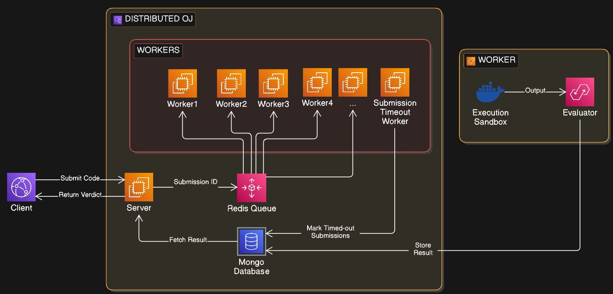

# Distributed OJ

A distributed online judge system that accepts code submissions, stores them in MongoDB, queues them in Redis, and processes them with a worker binary.

## Overview

This project has three main parts:

- A Node.js server in the server directory that accepts submissions via HTTP.
- A C++ worker process that listens for queued jobs and executes submitted code.
- MongoDB and Redis as the backing services for job storage and queueing.

## Project Structure

- server/ - Express API server
- src/ - C++ worker implementation
- build/ - CMake build output
- docker/ - container-related files

## Architecture

This project is built around a distributed execution model in which the API server and the judging workers are separate components.



### How the distributed workers work

1. A client sends a submission to the Express API.
2. The API validates the payload and writes a job record to MongoDB.
3. The API pushes the job ID into a Redis queue named by the QUEUE_NAME setting.
4. One or more worker processes read from that queue and claim jobs for execution.
5. Each worker loads the full job details from MongoDB, runs the submission inside a Docker sandbox, and records the result back to MongoDB.
6. The worker can update the job state from pending to running, completed, or failed as execution progresses.

### Main Components

- API layer: Node.js/Express server in server/app.js
- Queueing: Redis for job distribution between producers and workers
- Persistence: MongoDB for storing job metadata, input/output, and verdicts
- Execution engine: C++ worker in src/ that runs submissions in isolated Docker containers
- Sandbox isolation: each submission is executed in a container with resource limits for CPU, memory, and process count


## Prerequisites

Make sure these are installed:

- Node.js and npm
- CMake
- A C++ compiler with C++17 support
- MongoDB
- Redis

## Installation

### 1. Clone the repository

```bash
git clone <repository-url>
cd distributed_oj
```

### 2. Install Node.js dependencies

```bash
cd server
npm install
```

### 3. Build the worker

```bash
mkdir -p build
cd build
cmake ..
make
```

### 4. Start the required services

Start MongoDB and Redis locally or through Docker.

Example with Docker:

```bash
docker compose up -d
```

If you are not using Docker, make sure MongoDB and Redis are running on their default ports.

## Running the Application

### Start the server

```bash
cd server
npm start
```

The server listens on port 3000 by default.

### Run the worker

From the project root:

```bash
./build/judge_worker
```

## API Usage

### Submit a job

```bash
curl -X POST http://localhost:3000/submit \
  -H "Content-Type: application/json" \
  -d '{
    "code": "print(1)",
    "input": "",
    "expected": "1",
    "language": "python"
  }'
```

### Check job status

```bash
curl http://localhost:3000/jobs/<job-id>
```

## Notes

The server uses environment variables for configuration:

- MONGO_URI
- MONGO_DB_NAME
- REDIS_URL
- QUEUE_NAME
- PORT

You can define them in a .env file at the project root.
